# ERD — JooShop

> 2026-09-27 기준, 실제 엔티티(`@Entity`) 코드 기준으로 재작성.
> 예전 Notion 페이지의 ERD는 `review`/`review_reply`/`orders_product_management` 등 지금은 없는 테이블이 남아있는 옛날 버전이라 폐기하고 새로 그림.
> 테이블명은 물리 DB 컬럼 기준 (`product_management`는 Java 엔티티명은 `ProductVariant`지만, 운영 데이터 보존을 위해 테이블명은 그대로 유지 — `README.md`의 "핵심 설계 원칙" 참고).

```mermaid
erDiagram
    member ||--o| member_profile : "1:1 프로필"
    member ||--o| refresh : "1:1 리프레시 토큰"
    member ||--o{ addresses : "배송지 등록"
    member ||--o{ cart : "장바구니 담기"
    member ||--o{ orders : "주문"
    member ||--o{ wish_list : "찜"
    member ||--o{ inquiry_table : "문의 작성 (선택)"
    member ||--o{ inquiry_reply : "답변 작성"
    member ||--o{ payment_history : "결제"

    category ||--o{ category : "상위/하위 카테고리"
    category ||--o{ product_management : "옵션 분류"

    products_table ||--o{ product_thumbnails : "대표 이미지"
    products_table ||--o{ content_Images : "상세 이미지"
    products_table ||--o{ product_management : "옵션(사이즈/색상)"
    products_table ||--o{ wish_list : "찜 대상"
    products_table ||--o{ inquiry_table : "문의 대상"
    products_table ||--o{ payment_history : "구매 상품"

    product_color ||--o{ product_management : "색상"

    product_management ||--o{ cart : "장바구니 항목"
    product_management ||--o{ order_product : "주문 항목"

    orders ||--o{ order_product : "주문 상세"
    orders ||--o{ payment_history : "결제 내역"

    payment_history ||--o| payment_refund : "환불"

    inquiry_table ||--o{ inquiry_reply : "답변"

    member {
        bigint member_id PK
        varchar email
        varchar nickname
        varchar member_role "USER, SELLER, ADMIN"
        varchar social_type "NONE, KAKAO, NAVER"
        boolean is_active
        boolean is_admin
    }

    member_profile {
        bigint profile_id PK
        bigint member_id FK
        varchar profile_img_path
        varchar member_ages
        varchar member_gender
    }

    refresh {
        bigint refresh_id PK
        bigint member_id FK
        varchar refresh_token
        timestamp expiration
    }

    addresses {
        bigint address_id PK
        bigint member_id FK
        varchar address
        varchar detail_address
        boolean is_default_address
    }

    category {
        bigint category_id PK
        bigint parent FK "self-reference"
        varchar name
        bigint depth
    }

    products_table {
        bigint product_id PK
        varchar product_name
        decimal price
        boolean is_discount
        int discount_rate
        boolean is_recommend
    }

    product_color {
        bigint color_id PK
        varchar color
    }

    product_management {
        bigint inventory_id PK "Java 필드명 variantId, 실제 컬럼명 inventory_id 유지"
        bigint product_id FK
        bigint color_id FK
        bigint category_id FK
        varchar gender
        varchar size
        long product_stock
        boolean is_sold_out
    }

    product_thumbnails {
        bigint thumbnail_id PK
        bigint product_id FK
        varchar images_path
    }

    content_Images {
        bigint content_img_id PK
        bigint product_id FK
        varchar images_path
    }

    wish_list {
        bigint wishlist_id PK
        bigint member_id FK
        bigint product_id FK
    }

    cart {
        bigint cart_id PK
        bigint member_id FK
        bigint product_variant_id FK "product_management.inventory_id 참조"
        int quantity
        decimal price
    }

    orders {
        bigint order_id PK
        bigint member_id FK
        varchar merchant_uid
        decimal total_price
        varchar payment_status
        varchar pay_method
    }

    order_product {
        bigint order_product_id PK
        bigint orders_id FK
        bigint product_variant_id FK "product_management.inventory_id 참조"
        decimal price_at_order
        int quantity
        boolean reviewed
    }

    payment_history {
        bigint payment_history_id PK
        bigint member FK
        bigint orders FK
        bigint product FK
        varchar imp_uid
        varchar payment_status
        decimal total_price
    }

    payment_refund {
        bigint payment_refund_id PK
        bigint payment_history FK
        varchar imp_uid
        int amount
        varchar reason
    }

    inquiry_table {
        bigint inquiry_id PK
        bigint member_id FK "선택 - 비회원 문의 가능"
        bigint product_id FK
        varchar inquiry_title
        boolean is_secret
        boolean is_response
    }

    inquiry_reply {
        bigint reply_id PK
        bigint inquiry_id FK
        bigint reply_by FK "Member"
        varchar reply_title
    }
```

## 예전 ERD와 달라진 점

- `review` / `review_reply` / `review_image` 테이블 — 실제 코드에 해당 엔티티가 없음(구현 안 됨). ERD에서 제외.
- `orders_product_management` — `Orders`↔`ProductVariant` 사이 옛날 `@ManyToMany` 조인 테이블 잔재. 리팩토링 중 DROP 완료, ERD에서 제외.
- `orderproduct` → `order_product`로 테이블명 통일 (리팩토링 완료).
- FK 컬럼명 `product_mgt_id`/`product_management_id` → `product_variant_id`로 통일 (리팩토링 완료).
- PK 컬럼명 `inventory_id`는 그대로 유지하되, Java 필드명만 `variantId`로 정리 (운영 데이터 보존을 위해 물리 컬럼은 안 건드림 — 이유는 `README.md` 참고).
